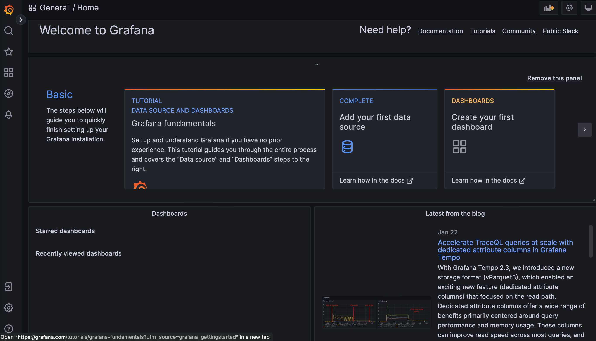
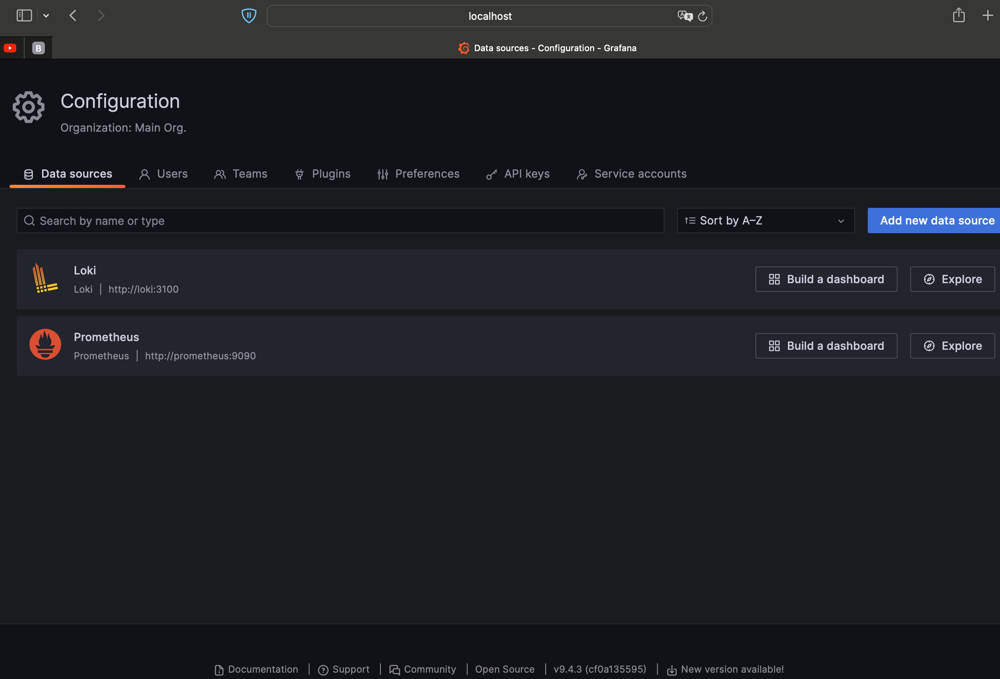
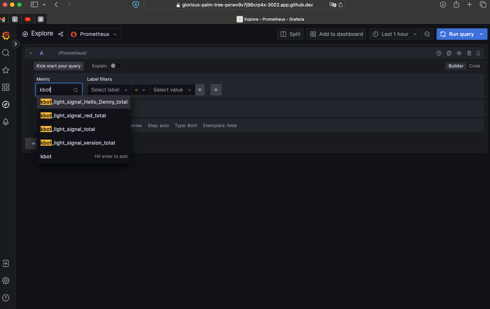
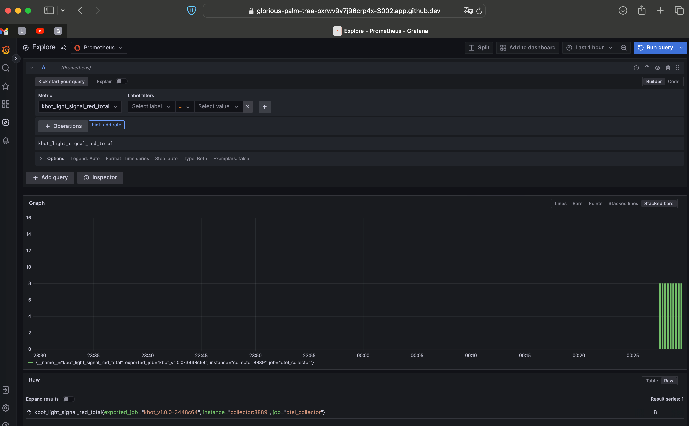
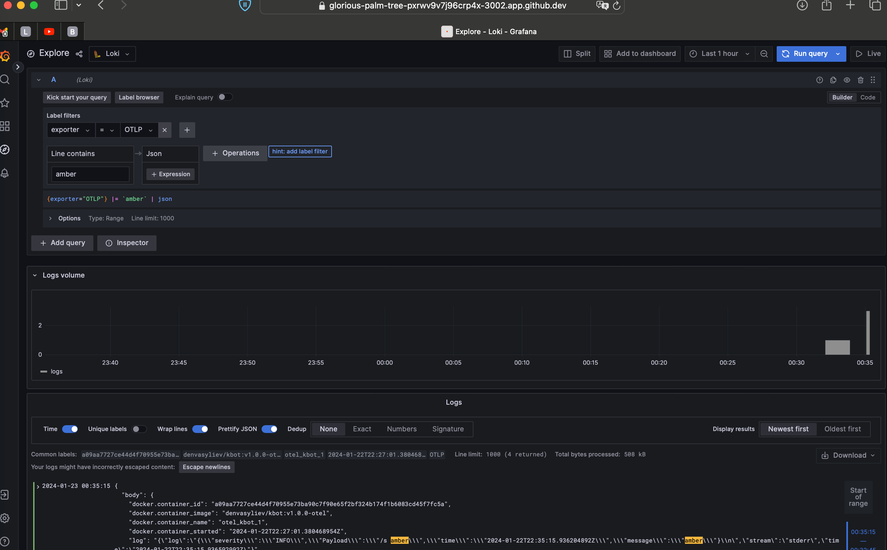
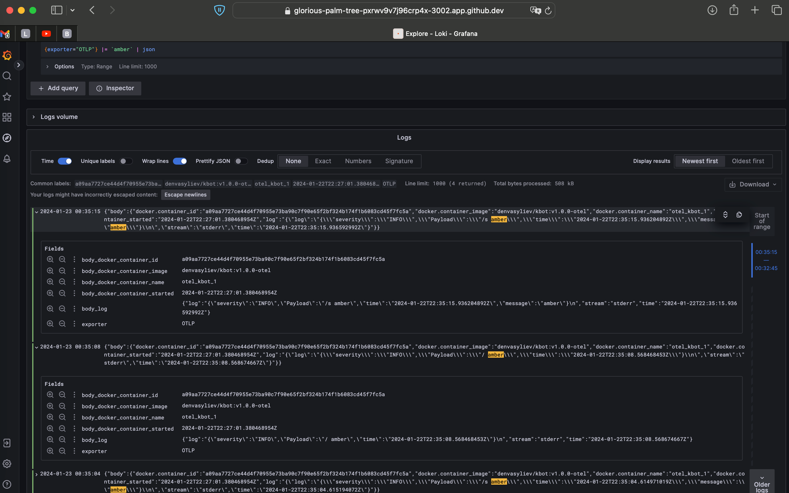
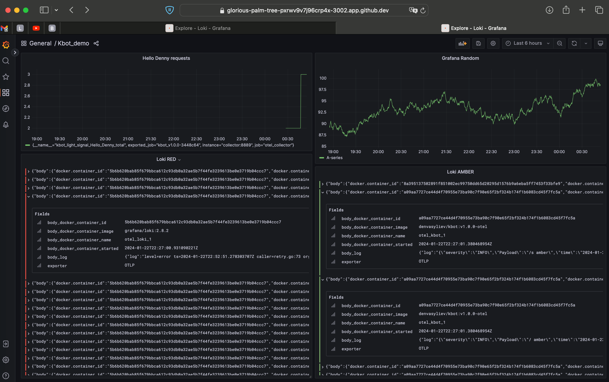

# w9task1 Open-telemetry observability.  K8s+OTEL

## Introduction

Sample configuration for Kbot that send logs to [OpenTelemetry Collector] and metrics to [OpenTelemetry Collector] or [Prometheus].
There is always neccessary to obtain a telemetry about status and performance of an application. There are a lot of tools to track the status for this purpose. We'll use a ready-made image based on the demo application denvasyliev/kbot:v1.0.0-otel, because in addition to the tools, we also need the application itself to generate logs about its work.

For telemetry processing and visualization, we will use Loki, Prometheus, Fluent Bit, and Grafana.

 - `Loki` is an open-source log aggregation system designed for cloud-native environments. Developed by Grafana Labs, it is a horizontally scalable and highly efficient solution that focuses on collecting, storing, and querying logs, making it well-suited for microservices architectures and containerized applications. Loki is known for its cost-effectiveness and compatibility with other observability tools, offering a lightweight and flexible approach to log management.

- `Prometheus` is an open-source monitoring and alerting toolkit designed for reliability and scalability in modern, dynamic environments. Created by the Prometheus community, it excels in collecting and storing time-series data, providing powerful querying capabilities and alerting based on customizable rules. Its pull-based model, support for multi-dimensional data, and integration with Grafana make Prometheus a popular choice for monitoring the performance and health of systems in cloud-native and containerized infrastructures.

- `Fluent Bit` is an open-source and lightweight log processor and forwarder that allows for efficient collection, parsing, and forwarding of logs in cloud-native environments. Developed by the Fluentd project, Fluent Bit is designed to be resource-efficient, making it suitable for edge computing and microservices architectures. It supports various input sources, output destinations, and filters, providing flexibility in log processing, and is often used in conjunction with other observability tools for log aggregation and analysis.

- `Grafana` is an open-source analytics and visualization platform that allows users to query, visualize, and understand their metrics and logs through customizable dashboards. Widely used in conjunction with data sources like Prometheus, InfluxDB, and Elasticsearch, Grafana supports a variety of data types and provides interactive, real-time insights into system performance and log data. Known for its user-friendly interface and extensive plugin ecosystem, Grafana is a popular choice for creating visually appealing and informative dashboards for monitoring and observability purposes.

## Prerequisites

- [Linux]
- [Docker]
- [Docker-Compose]

## How to run

Add your API token
```bash
read -s TELE_TOKEN
`paste your token`
export TELE_TOKEN=$TELE_TOKEN
```
Run
```bash
docker-compose up
```
Send commands from the bot

`/start` – to get the firts instruction
Usage: /s red|amber|green
`/s red` – send a command red
Switch red light signal to 1 - response to a command, repetition – Switch red light signal to 0

## Monitoring 

Welcome to `Grafana` http://localhost:3002/

check our datasources

select the kbot_ metric

receive information of the red signal

let's switch to `Loki` and filter the log for the amber signal

you can easily view logs in json format by adding the appropriate expression


Kbot_demo dashboard
